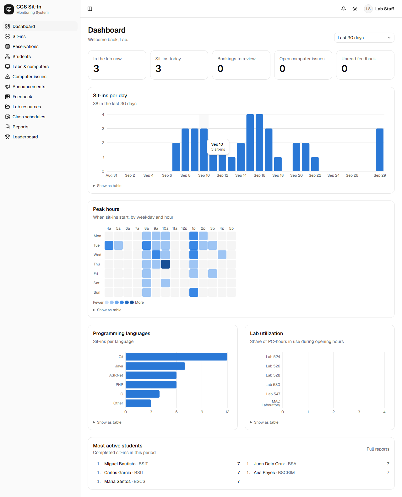
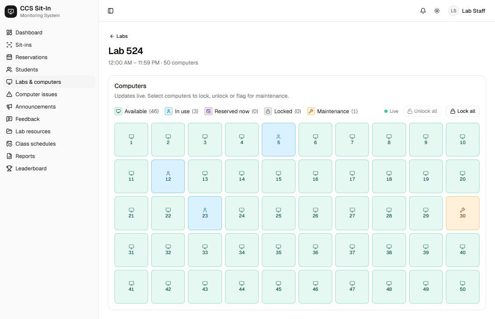
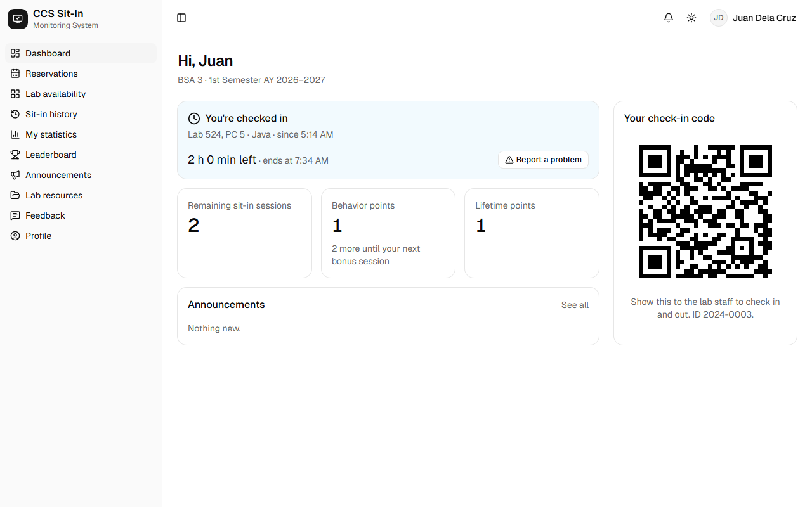
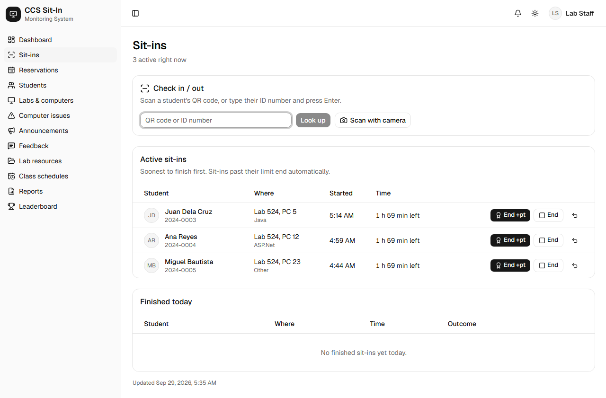
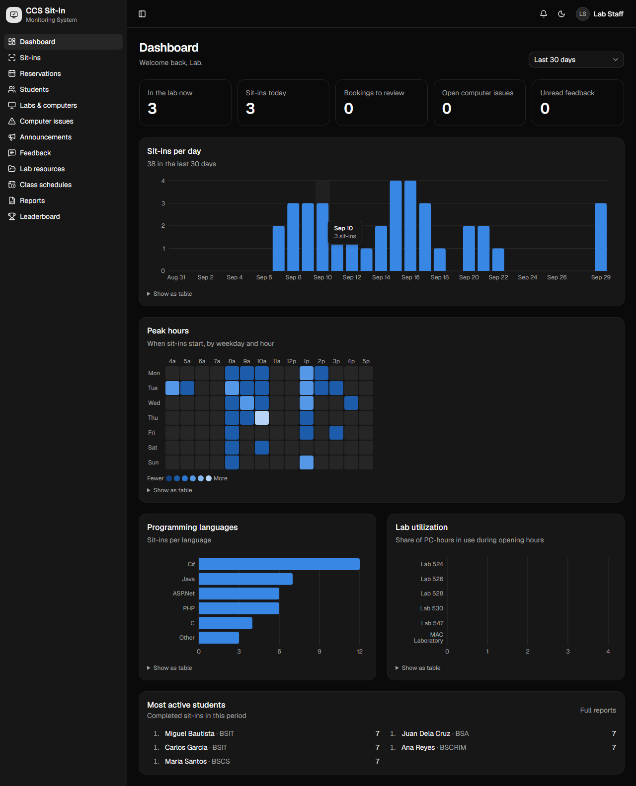

# CCS Sit-In Monitoring System

A web app for running a college's computer labs: students check in with a QR code, book
computers ahead of time, and see live which PCs are free. Lab staff get a check-in desk, a
live map of every lab, reports and analytics.

It's a ground-up rewrite of my original PHP/MySQL college project
([SysArch-SitInMonitoringSystem](https://github.com/FitzFitzFitzACJR/SysArch-SitInMonitoringSystem)).
It keeps every feature of the original, fixes its security and data problems, and adds the
features a real lab would need.



<table>
  <tr>
    <td></td>
    <td></td>
  </tr>
  <tr>
    <td></td>
    <td></td>
  </tr>
</table>

## What it does

**Students**

- Get a personal **QR code** for checking in and out at the lab desk.
- **Book a computer** for a time slot: pick a lab, a slot, then a free PC from the grid.
  Staff approve the booking (optional), the student gets an email reminder, and no-shows
  expire automatically.
- See the **live lab map** before walking over. It shows which PCs are free, in use,
  reserved or in maintenance, and updates in real time.
- Track remaining sessions, behaviour points, sit-in history, personal statistics and the
  **leaderboard**.
- **Report a broken computer** from an active sit-in, send feedback, read announcements and
  lab resources.
- Accept the lab rules once per rules version before their first sit-in. Works on phones
  and **installs as an app** (PWA).

**Lab staff and admins**

- **Check-in desk:** scan a QR code with the camera or type an ID, then pick the lab, PC and
  language. Reservations and reserved PCs are applied automatically.
- **Time limits:** sit-ins warn the student near the end and end on their own at the time
  limit or at closing time.
- **Live lab map:** lock, unlock or flag computers for maintenance, one at a time or in bulk.
- **Reservations calendar:** week view per lab, with conflicts prevented by the database
  itself.
- **Students:** search, edit, bulk **CSV/Excel import** with row-by-row validation, and
  manual points or sessions.
- **Semesters:** each new semester resets session allotments automatically.
- **Class schedules:** they block time slots from being booked.
- **Communication:** announcements (pinned, scheduled, targeted by course or year), feedback
  inbox, and computer issue tracking.
- **Reports:** filter by date, lab, course or language and export to **CSV or PDF**. The
  **analytics dashboard** shows sit-ins per day, a peak-hours heatmap, language mix and lab
  utilisation.
- **Admin:** an **audit log** of every change, and a settings page for lab hours, limits,
  points rules, lockout and lab rules.

**Roles:** `SUPER_ADMIN`, `LAB_STAFF` (runs the desk; no settings, staff management,
deletions or audit log) and `STUDENT`. Permissions are checked on the server for every
page and action, not just hidden in the menu.

## Tech stack

| Area          | Choice                                                                                                  |
| ------------- | ------------------------------------------------------------------------------------------------------- |
| Framework     | **Next.js 16** (App Router, Server Components, Server Actions, route handlers), **TypeScript** (strict) |
| Data          | **PostgreSQL** + **Prisma 7** (migrations, seed, `pg` driver adapter)                                   |
| Auth          | **Auth.js v5** credentials, **argon2id** hashing, JWT sessions revalidated against the DB               |
| Validation    | **Zod** schemas shared by forms (client) and actions (server)                                           |
| UI            | **Tailwind CSS 4**, **shadcn/ui** (Radix), light/dark theme, **Recharts**                               |
| Realtime      | Server-Sent Events for the live lab map                                                                 |
| Email / files | **Resend** (transactional outbox), **Vercel Blob** (local disk in dev)                                  |
| Exports       | CSV (formula-injection safe), PDF via **pdfkit**, Excel import via **exceljs**                          |
| Testing       | **Vitest** (82 unit tests), **Playwright** end-to-end + **axe-core** accessibility scan                 |
| Tooling       | ESLint, Prettier, Docker Compose (Postgres)                                                             |

## Architecture

```text
Browser ──► proxy.ts (is there a session?) ──► page / server action / route handler
                                                   │
                         requireStaff("permission") / createAction(schema, access, handler)
                                                   │   auth → permission → Zod → handler
                                                   ▼
                                  src/features/<domain>/service.ts   ← business rules
                                                   │   one transaction: change + audit entry
                                                   ▼
                                        Prisma ──► PostgreSQL
                                                   ▲   partial unique indexes & CHECKs
                                                   │   as the last line of defence
             cron (/api/cron/*) + lazy sweeps ─────┘   end overdue sit-ins, no-shows,
                                                       semester reset, email outbox
```

- **Feature folders.** Each domain in `src/features/<domain>/` has `schemas.ts` (Zod,
  shared by client and server), `service.ts` (the rules, and the only code that writes),
  `queries.ts` (reads), `actions.ts` (thin server actions) and `components/`. Pure rules
  such as time-limit maths, slot conflicts and ranking live in `rules.ts` files and are
  unit-tested without a database.
- **One action wrapper.** Every mutation goes through `createAction`, which authenticates,
  checks the permission, parses input with the shared Zod schema, maps domain errors to
  friendly messages, and flushes queued emails after the response.
- **The database enforces the invariants.** Partial unique indexes guarantee:
  - one active sit-in per student and per computer
  - one live reservation per computer and slot, and per student and slot

  So two staff clicking at the same moment can't double-book. Reservations use serializable
  transactions with retry.

- **Points are a ledger.** Every change to sessions or points is a `PointsLog` row, and
  balances always equal the ledger's sum. The leaderboard is derived from sit-ins and
  points; it isn't a separate table that can drift.
- **Time handling.** Lab hours and slots are minutes after midnight in the lab's timezone
  (a setting), converted with explicit timezone helpers. The server's own timezone never
  matters.
- **Scheduled work is idempotent.** Sweeps (auto-end sit-ins, reminders and no-shows,
  semester reset, email outbox) run from cron endpoints, and lazily when pages load, so
  running them late or twice is harmless.
- **Audit trail.** Staff actions write an audit entry in the same transaction as the change.

## Improvements over the original

| Original PHP app                                                                                                 | This version                                                                                                            |
| ---------------------------------------------------------------------------------------------------------------- | ----------------------------------------------------------------------------------------------------------------------- |
| Admin was whoever had ID number `00`; credentials hardcoded in the code                                          | Real roles and permissions, checked on the server; first admin from env vars, forced to change the password             |
| SQL built by string concatenation (**SQL injection**)                                                            | Parameterised queries through Prisma; all input validated with Zod                                                      |
| No **CSRF** protection on state-changing requests                                                                | Server Actions (origin-checked POSTs), `SameSite` session cookies, security headers                                     |
| Plain-text / weak password handling                                                                              | argon2id; legacy bcrypt hashes verified and upgraded on login; login rate limiting and lockout; password reset by email |
| Giant multi-thousand-line pages, `homepage.bak.php`, `homepage_fixed_brace.php`, `fix_*.php` scripts in the repo | Small typed modules per feature; one source of truth; git for history                                                   |
| Duplicate tables (two feedback tables, a stored leaderboard)                                                     | One normalised schema; leaderboard calculated from sit-ins                                                              |
| Timestamps written by MySQL (Manila) and PHP (Berlin) clocks, so durations of −360 minutes                       | Every instant stored in UTC; one configurable lab timezone                                                              |
| Labs hardcoded in HTML                                                                                           | Labs, computers, slots, courses and languages are data, editable in the UI                                              |
| Sit-ins could be left "active" forever; double check-ins possible                                                | Time limits, warnings, auto-end at closing; database-enforced uniqueness                                                |
| No tests                                                                                                         | 82 unit tests, Playwright end-to-end tests, automated accessibility scan                                                |

A one-off importer (`npm run legacy:import`) moves the original `sysarch.sql` data across,
fixing the timezone and duplicate-data problems on the way. See
[Migrating from the original](#migrating-from-the-original-php-system).

## Running locally

Requirements: **Node.js 20.9+** and **Docker Desktop**.

```bash
cp .env.example .env        # then set AUTH_SECRET (npx auth secret)
npm install
npm run db:up               # Postgres in Docker
npm run db:deploy           # apply migrations
npm run db:seed             # labs, computers, slots, admin + demo accounts
npm run dev                 # http://localhost:3000
```

### Demo accounts

Created by the seed when `SEED_DEMO=true` (the default in `.env.example`):

| Role        | ID number                                | Password                                                    |
| ----------- | ---------------------------------------- | ----------------------------------------------------------- |
| Super admin | `SEED_ADMIN_ID_NUMBER` (default `admin`) | `SEED_ADMIN_PASSWORD`. You'll be asked to choose a new one. |
| Lab staff   | `staff`                                  | `SEED_DEMO_PASSWORD`                                        |
| Students    | `2024-0001` … `2024-0005`                | `SEED_DEMO_PASSWORD`                                        |

In development, emails (password resets, booking reminders, staff invites) are printed to
the dev server console unless `RESEND_API_KEY` is set.

## Testing

```bash
npm test               # unit tests (Vitest)
npm run typecheck
npm run lint
npm run test:e2e       # Playwright end-to-end + accessibility (needs Docker Postgres running)
```

The end-to-end suite creates its own throwaway database, `ccs_e2e`, starts a dev server on
port 3100, and covers:

- sign-in errors, forced password change, and role guards
- the full sit-in lifecycle: lab rules, check-in at the desk, live map, the student's view,
  ending with a reward
- reservation request and approval
- an **axe-core WCAG 2.1 AA scan** of the main student and staff pages in light and dark mode

To regenerate the README screenshots, run `SCREENSHOTS=1 npx playwright test screenshots`.

## Deploying

The app is built for **Vercel + Neon/Supabase**. See **[docs/DEPLOYMENT.md](docs/DEPLOYMENT.md)**
for environment variables, pooled and direct database URLs, migrations on deploy, seeding,
cron setup (including on the free Hobby plan) and file storage.

## Scripts

| Command                                                 | What it does                                                |
| ------------------------------------------------------- | ----------------------------------------------------------- |
| `npm run dev`                                           | Dev server                                                  |
| `npm test` / `npm run test:e2e`                         | Unit / end-to-end tests                                     |
| `npm run typecheck` / `npm run lint` / `npm run format` | Checks and formatting                                       |
| `npm run db:up`                                         | Start Postgres in Docker                                    |
| `npm run db:deploy` / `npm run db:migrate`              | Apply migrations / create one after editing `schema.prisma` |
| `npm run db:seed` / `npm run db:reset`                  | Seed (idempotent) / wipe and re-migrate the dev database    |
| `npm run db:studio`                                     | Browse the database                                         |
| `npm run legacy:import`                                 | Import data from the original `sysarch.sql`                 |

## Project layout

```text
prisma/              schema, migrations (incl. raw-SQL business-rule indexes), seed
src/app/             routes: (auth), (student), admin/, api/ (auth, cron, SSE, exports, files)
src/features/<x>/    one folder per domain: schemas · rules · service · queries · actions · components
src/components/      app shell, charts, forms, shadcn/ui
src/lib/             db, auth, permissions, action wrapper, email, storage, time helpers
scripts/legacy-import/  one-off importer for the original MySQL dump
tests/unit/          Vitest
tests/e2e/           Playwright (+ axe, + README screenshots)
docs/                deployment guide, screenshots
```

## Migrating from the original PHP system

`scripts/legacy-import` reads the old `sysarch.sql` MySQL dump and imports it into this
database in a single transaction (all or nothing). Run it after migrating and seeding:

```bash
npm run legacy:import -- --file path/to/sysarch.sql --dry-run
npm run legacy:import -- --file path/to/sysarch.sql --uploads path/to/old/uploads --default-lab 524
```

What it does:

- **Users**: keeps the old bcrypt password hashes (they're upgraded to argon2 at each
  person's next login; any plain-text password is hashed on import). The old admin
  (`idno` `00`) becomes a super admin who must change their password. Course numbers map
  to BSIT/BSA/BSCS/BSCRIM. `--uploads` brings profile photos across (re-encoded).
- **Points & sessions**: old `points_log` rows become history, plus an opening balance,
  so every balance equals its ledger.
- **Sit-ins**: the old app wrote `session_start` with MySQL's clock (Manila) and
  `session_end` with PHP's `date()` (XAMPP's default Europe/Berlin), which is why it
  showed a −360-minute duration. Each column is read in its own zone (`--mysql-tz`,
  `--php-tz`); that sit-in really lasted 14 seconds. Sit-ins left "active" or forgotten
  for days are closed at the time limit or closing time, as the new system would have.
- **Reservations**: rows where the language was saved as the purpose are swapped back;
  past bookings are closed (so the no-show job can't penalise them); rows without a room
  are skipped unless you pass `--default-lab`.
- **Everything else**: announcements (inactive ones archived), both feedback tables, link
  resources (old local files must be re-uploaded), class schedules. The leaderboard table
  isn't needed: it's now calculated from sit-ins.

It prints a table of what was imported/skipped and a note for every correction, and it
refuses to run twice against the same database.
